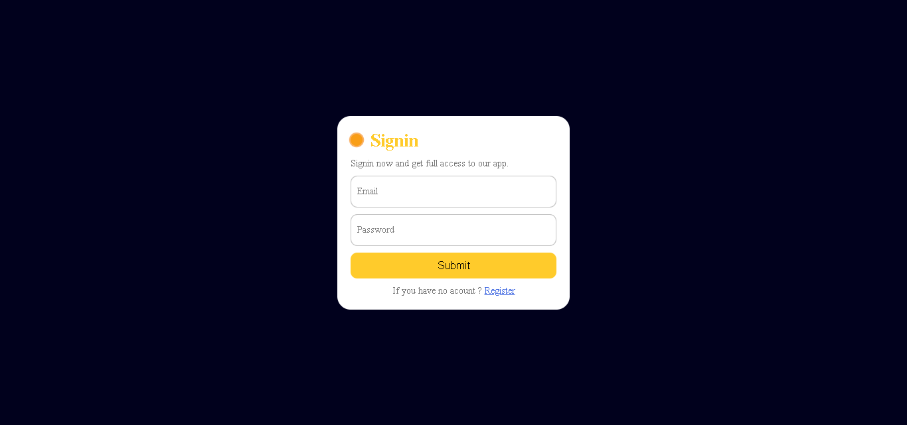

# 🔐 Firebase Authentication Mini Project 🚀

Welcome to the Firebase Authentication Mini Project! This project showcases a basic implementation of user registration and authentication using Firebase. Dive into the code to explore how users can securely register, sign in, and sign out.


## Project Structure 📁

- `index.html`: Main HTML file containing the user interface for registration and authentication.
- `style.css`: CSS file for styling the HTML elements.
- `app.js`: JavaScript file handling the Firebase authentication logic.

## Register

## Signin

## Home


## Technologies Used 🛠️

- HTML
- CSS
- JavaScript
- Firebase Authentication

## Features ✨

1. **User Registration**: Allow users to create an account securely.
2. **Email Verification**: Implement email verification for registered users.
3. **Secure User Authentication**: Ensure safe and secure user sign-in.
4. **Password Reset**: Enable users to reset their passwords.
5. **Sign Out**: Allow users to sign out securely.

## Getting Started 🏁

1. **Clone the repository:**

   ```bash
   git clone https://github.com/ayeshasikander/Authentication-using-Firebase.git
   ```

2. **Open the project in Visual Studio Code:**


3. **Set up Firebase:**
   - Create a new project on the [Firebase Console](https://console.firebase.google.com/).
   - Enable Email/Password authentication in the Authentication section.
   - Copy and paste your Firebase configuration into the `firebaseConfig` object in `app.js`.

4. **Open with Live Server:**
   - If you have the Live Server extension installed, right-click on `index.html` and select "Open with Live Server."


## Firebase Configuration 🔥

To connect the project with Firebase, replace the placeholder in `app.js` with your Firebase project configuration.

```javascript


## Contributions 🤝

Contributions are welcome! If you find any issues or have ideas for improvements, feel free to create a pull request or open an issue.

## License 📜

This project is licensed under the MIT License - see the [LICENSE](LICENSE) file for details.

Happy coding! 🔐🚀